# Self Introduction

 

---

**I am from Huazhong University of Science and Technology. I am studying at School of Electronic Information and Communications Elite Engineer Class.**

---

**My skillset**

* C
* C++
* Java
* Python
* Swift
* Verilog
* Matlab
* FPGA
* MPU
* Analog circuit
* Digital circuit

---

# My projects
## ICDAR-2015 Dataset Label

https://github.com/Dedsec-Xu/DatasetImgLabel-ICDAR2015

LabelImg is a graphical image annotation tool. Developed using Qt C++ and Python.

The users can use this gui software to make ICDAR 2015 format dataset simply by dragging.

It also implemented a ML model to detect words in the scene. The reported results on ICDAR2013 are:

|Model|totalM|totalN|totalK|Recall|Precision|H-mean|
|---|---|---|---|---|---|---|
|PixelLink|1095|1090|704|64.30%|64.587%|64.44%|

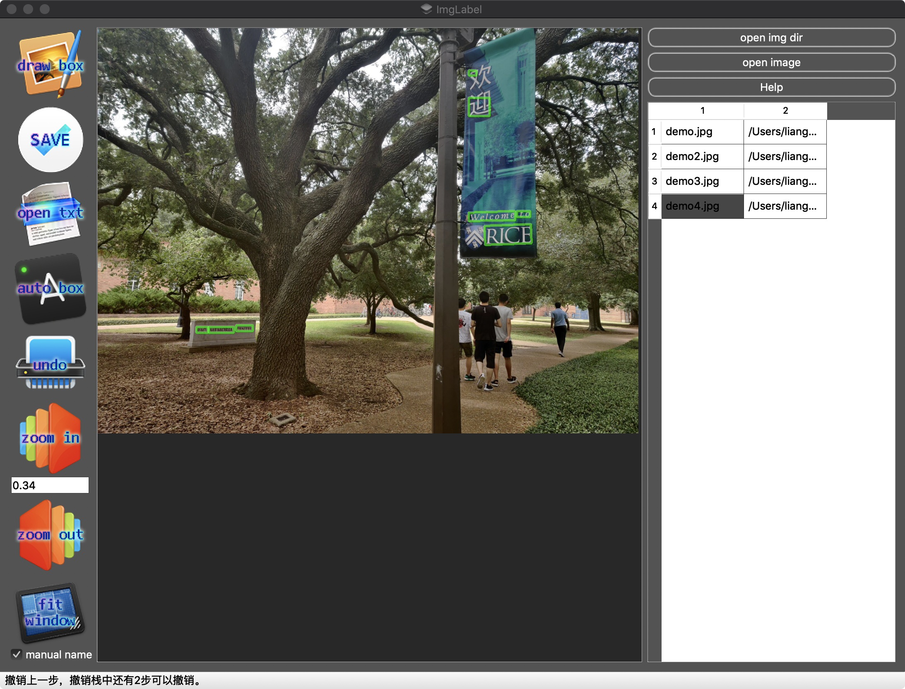

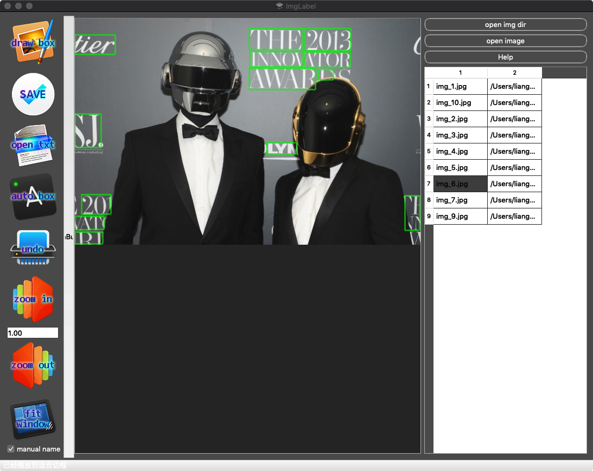

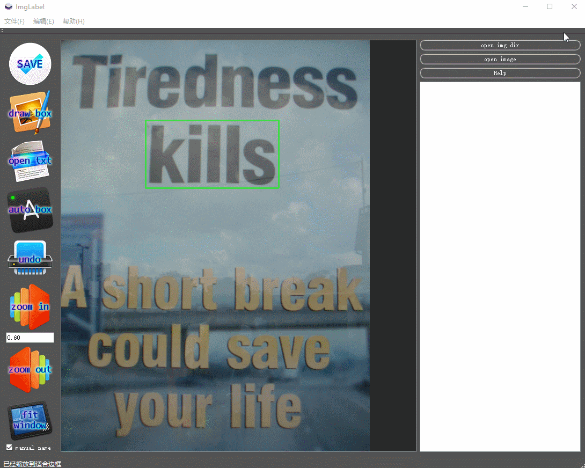
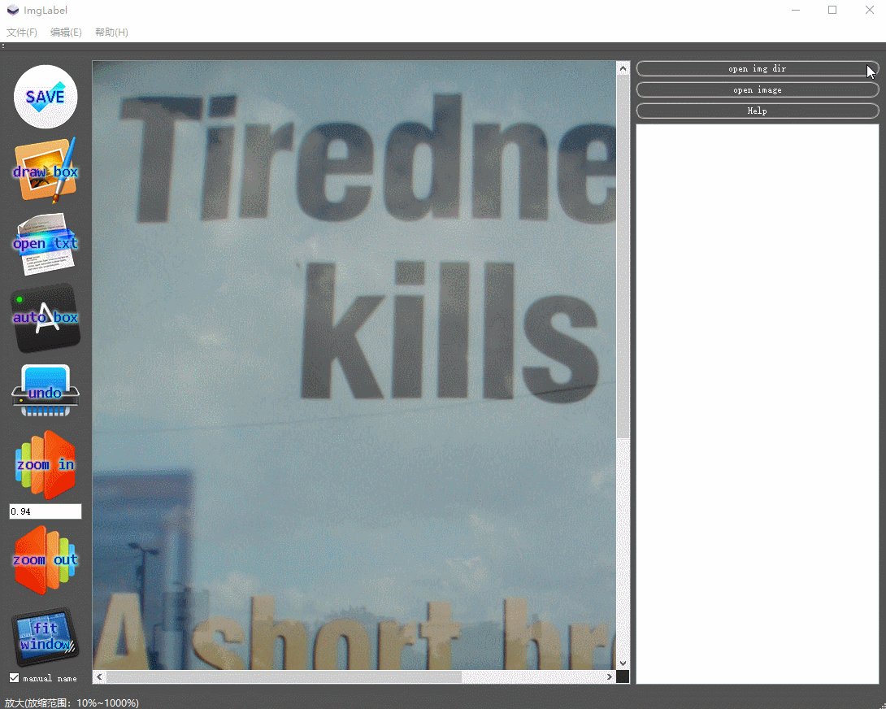

## Seed_Cup_TextCNN
https://github.com/Dedsec-Xu/Seed_Cup_TextCNN

Code for Seed Cup Machine Learning competetion. We developed a CNN NLP model which can process Masked Data of a product description and decide the category of the product.  The final score is 86.04%. 

example
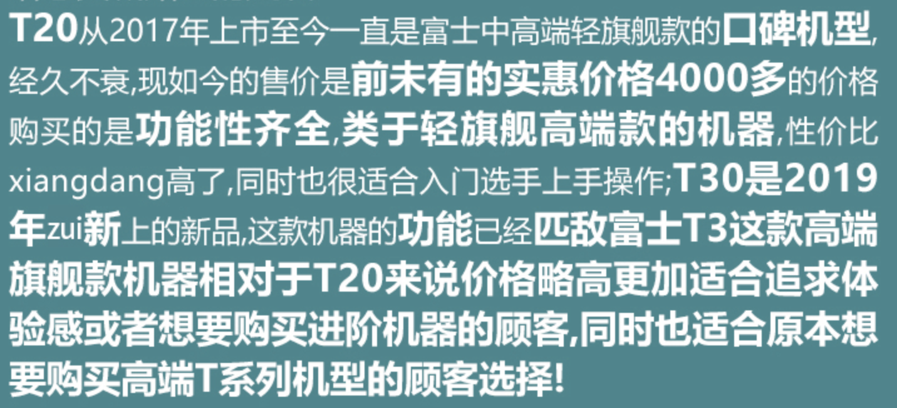
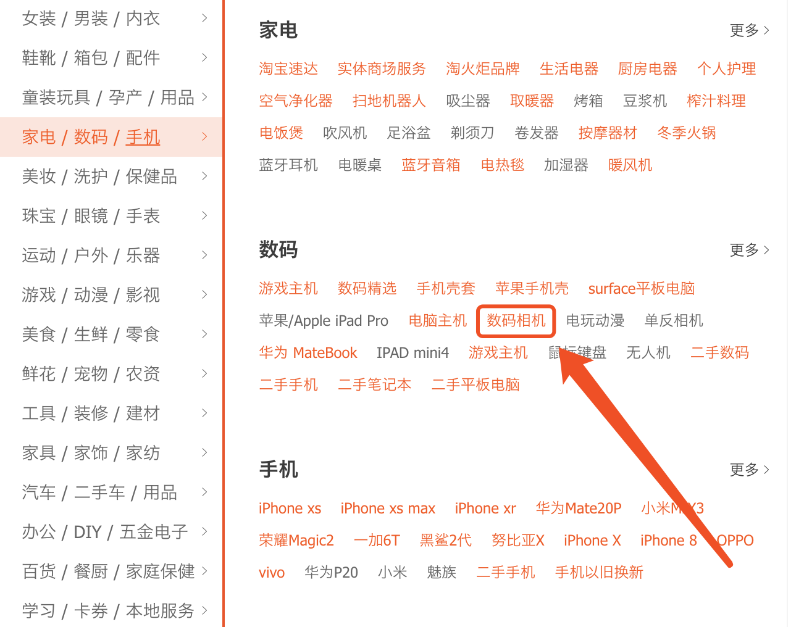

## matlab music player
https://github.com/Dedsec-Xu/Matlab_music

A simple matlab music player with multiple functions: Piano mode

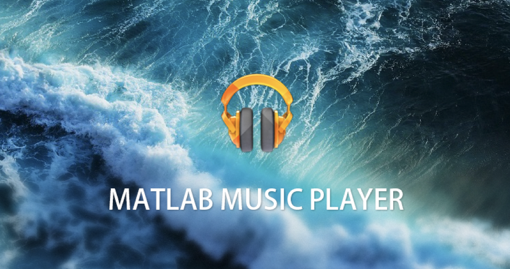
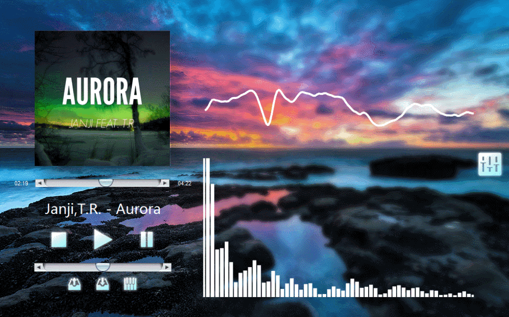
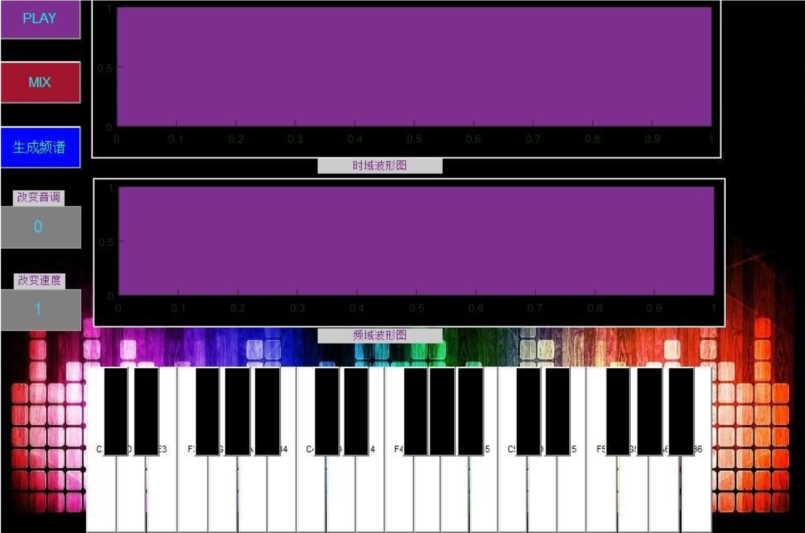
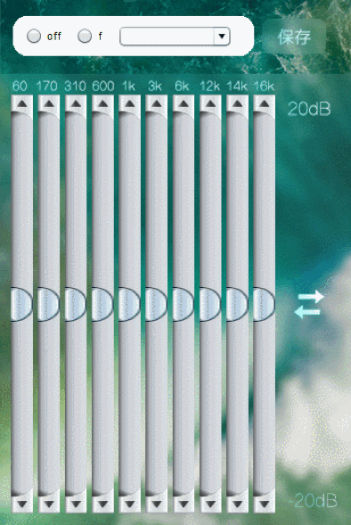

## wwdc 2019 scholarship(not pass)

https://github.com/Dedsec-Xu/THE-ANGRY-QUEENS

A swift playground demonstrating eight queen problem with a game.

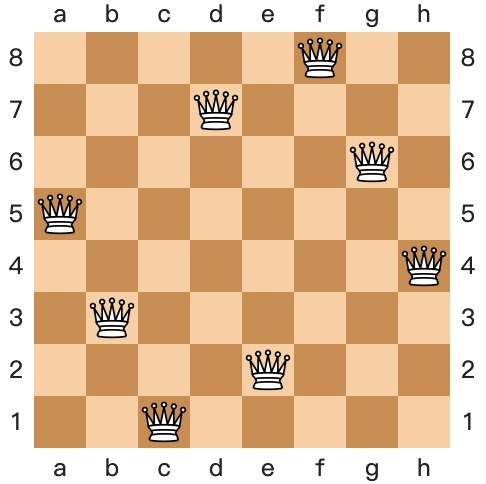

## Music Visualizer Circut

https://youtu.be/e310kDNNbSg?t=247

A swift playground demonstrating eight queen problem with a game.

## Rubik’s Cube Robot
https://youtu.be/lwa5qByJMJc?t=164

Rubik’s Cube Robot is a project that I worked on in Sophomore year. It is capable of solving any rubix cube in 3 seconds.
A FPGA board serves as the Lower machine, which controls rotors by generating PWM waves.
A cellphone serves as the Upper machine. It calculates the formula and control the FPGA board via Bluetooth.
I led a 3-men team to finish this project.

## ROS+LiDAR Robot
https://github.com/Dedsec-Xu/LiDAR_ros_Robot

The robot is based on STM32 MCU and raspberry pie.
It can navigate to IoT devices and charge them wirelessly. The charge strategy is based on WIFI information exchange and Greedy Algorithm.
I led a 5-men team to finish this project in 2 weeks.
This project won third place in the TI cup competition.

[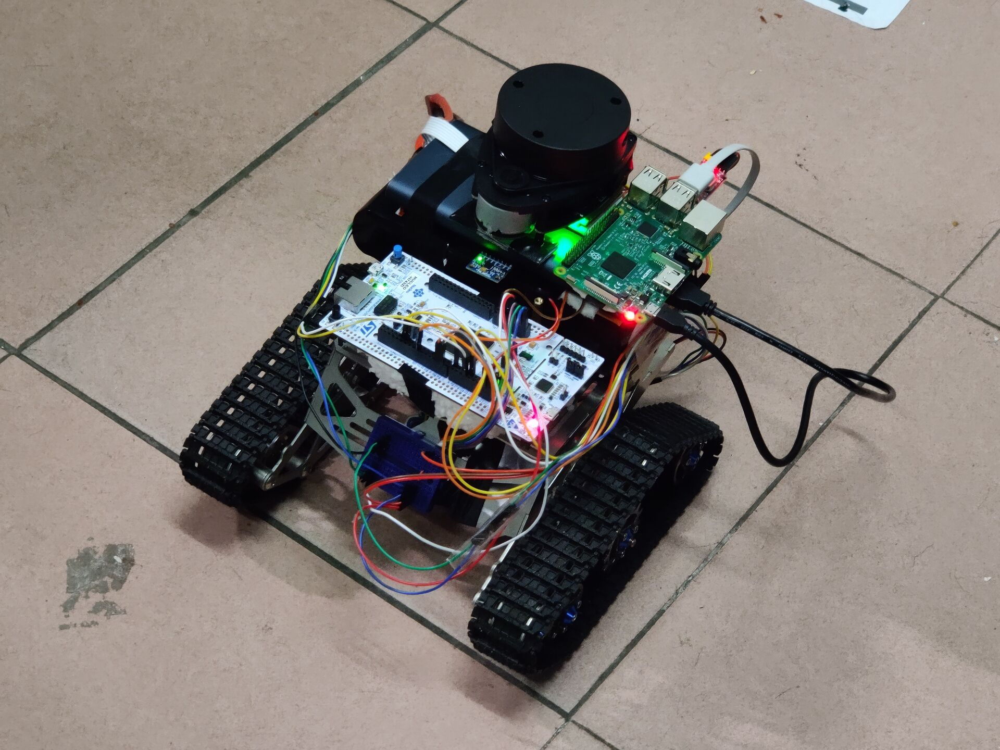](https://github.com/Dedsec-Xu/LiDAR_ros_Robot)

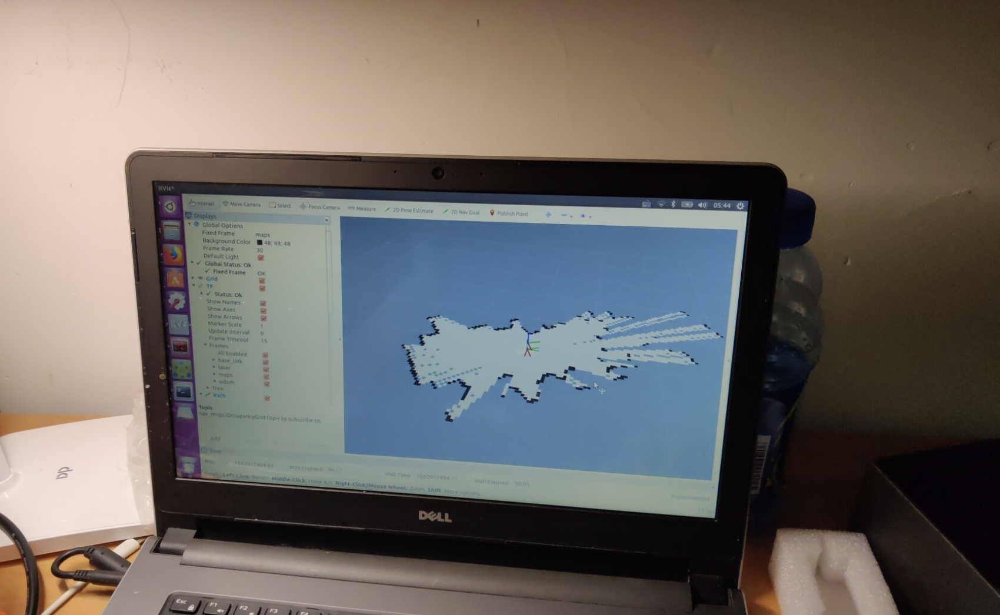

LiDAR mapping and navigation.

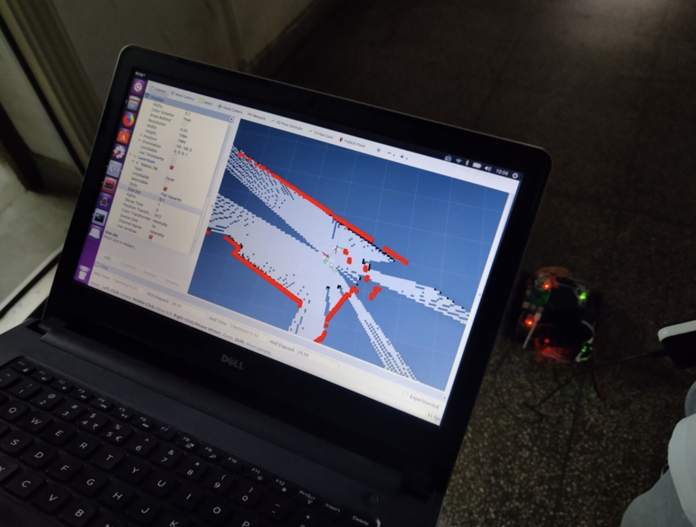

